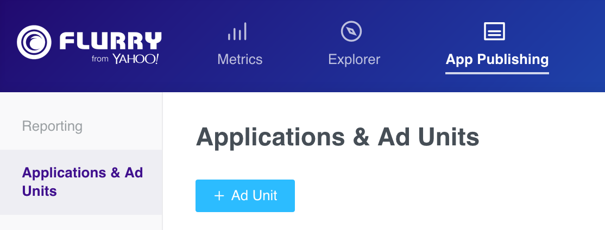

[Archived] Flurry Android Adapter for MoPub
===========================================

Adapter version 6.5.0 - Updated 2016-08-29
-------------------------------------------------------

**NOTE**: Future updates to this adapter will no longer be provided here. The adapter will now be maintained as part of the 
[MoPub SDK](https://github.com/mopub/mopub-android-sdk) and latest versions can be obtained from there. To raise an issue regarding the adapter, 
please contact support@flurry.com.

This version of the adapter works with MoPub Android SDK 4.8+ and Flurry Android SDK 6.2+. If using older versions of **both**
the MoPub and Flurry SDK, please refer to [version 5.4.0](https://github.com/flurry/FlurryAdapterForMoPubAndroid/tree/v5.4.0_for_mopub_pre_4.0.0) of the adapter. 
Otherwise, please upgrade to the newer versions of both SDKs.

###  Mediate Flurry Ads through MoPub

To integrate Flurry as the Custom Native Network in the MoPub ad serving flow, you need the
Custom Event Class code incorporated into your application in addition to the Flurry SDK.
Three quick steps are necessary:

1. Integrate the Flurry SDK and Flurry adapter for MoPub code into your app
2. Configure Flurry's Ad unit(s)
3. Configure MoPub to mediate Flurry

#### Integrate the Flurry SDK and Flurry adapter for MoPub code into your app

1. If your application is not yet using Flurry analytics, create a new application on Flurry's
dev portal. After logging into https://y.flurry.com, click the **Admin**  tab and go to the **Applications** page. 
From this page, click the **New App** button to go through the process of adding a new app. Take note of the API key 
generated for your app, as that would be useful when configuring a new ad unit on MoPub.

    

2. Add the [Flurry Android SDK](https://developer.yahoo.com/flurry/docs/integrateflurry/android/#install-flurry-android-sdk) to your app.

3. Add the Google Play Services SDK to your project. This is required for Android Advertising ID
support. See http://developer.android.com/google/playservices/setup.html.

4. Add the Flurry MoPub adapter classes (found in the [com.mopub.mobileads](src/com/mopub/mobileads)
& [com.mopub.nativeads](src/com/mopub/nativeads) package) to your project. Place the following
classes in com.mopub.mobileads:
    * [`FlurryCustomEventBanner`](src/com/mopub/mobileads/FlurryCustomEventBanner.java)
    * [`FlurryCustomEventInterstitial`](src/com/mopub/mobileads/FlurryCustomEventInterstitial.java)
    * [`FlurryAgentWrapper`](src/com/mopub/mobileads/FlurryAgentWrapper.java)
    
    Place the following classes in the com.mopub.nativeads package:

    * [`FlurryCustomEventNative`](src/com/mopub/nativeads/FlurryCustomEventNative.java)
    * [`FlurryBaseNativeAd`](src/com/mopub/nativeads/FlurryBaseNativeAd.java)
    * [`FlurryNativeAdRenderer`](src/com/mopub/nativeads/FlurryNativeAdRenderer.java) <sup>1</sup>
    * [`FlurryViewBinder`](src/com/mopub/nativeads/FlurryViewBinder.java) <sup>1</sup>

5. Follow the [MoPub Custom Event integration steps](https://github.com/mopub/mopub-android-sdk/wiki/Integrating-Third-Party-Ad-Networks)
for integrating banner and interstitial ads.

6. The steps to integrate Flurry Native Ads via MoPub are similar to those described [here](https://github.com/mopub/mopub-android-sdk/wiki/Native-Ads-Integration):
    * Create an XML layout for your native ads
    * Define where ads should be placed within your feed
    * Create a MoPubAdAdapter to wrap your existing `Adapter` subclass and begin loading ads.
 
 If using Flurry native video ads <sup>1</sup>, you should register the `FlurryNativeAdRenderer` as a custom ad renderer and pass in your video view into
 `FlurryViewBinder`.

 ```java
 ViewBinder binder = new ViewBinder.Builder(R.layout.native_ad_list_item)
            // Set up your regular ViewBinder
            .build();

 // Configure FlurryViewBinder with your video view
 FlurryViewBinder flurryBinder = new FlurryViewBinder.Builder(binder)
            .videoViewId(R.id.native_video_view)
            .build();

 // Register the FlurryNativeAdRenderer to handle both Flurry video and static native ads
 final FlurryNativeAdRenderer flurryRenderer = new FlurryNativeAdRenderer(flurryBinder);
 mAdAdapter = new MoPubAdAdapter(getActivity(), adapter);
 mAdAdapter.registerAdRenderer(flurryRenderer);
 
 //...register other native ad renderers as required
 ```

7. If you plan to run [ProGuard](http://developer.android.com/tools/help/proguard.html) on your app
before release, you will need to add the following to your ProGuard configuration file.

 ```
 # Preserve Flurry
 -keep class com.flurry.** { *; }
 -dontwarn com.flurry.**
 -keepattributes *Annotation*,EnclosingMethod,Signature
 -keepclasseswithmembers class * {
     public <init>(android.content.Context, android.util.AttributeSet, int);
 }

 # Google Play Services library
 -keep class * extends java.util.ListResourceBundle {
     protected Object[][] getContents();
 }

 -keep public class com.google.android.gms.common.internal.safeparcel.SafeParcelable {
     public static final *** NULL;
 }

 -keepnames @com.google.android.gms.common.annotation.KeepName class *

 -keepclassmembernames class * {
     @com.google.android.gms.common.annotation.KeepName *;
 }

 -keepnames class * implements android.os.Parcelable {
     public static final ** CREATOR;
 }

 # Preserve GMS ads identifier classes
 -keep class com.google.android.gms.ads.identifier.** {*;}
 ```

<sup>1</sup> __IMPORTANT__: If you are not using Flurry video ads, you do not need to include the 
`FlurryNativeAdRenderer` and `FlurryViewBinder` classes into your project. While the `FlurryNativeAdRenderer` can render
both Flurry video and static native ads, you will have to explicitly include it as a renderer in your code 
(see step 7 above). If you do not include the classes in your project, the MoPub SDK will use the existing 
`MoPubStaticNativeAdRenderer` to render Flurry static native ads.

#### Configure Flurry Ad unit(s)

For each MoPub ad unit that you would like to mediate Flurry through, please create a matching ad
unit on the [Flurry dev portal](https://y.flurry.com). Log into the developer portal and navigate
to the **App Publishing** tab. On the lefthand navigation bar select **Applications & Ad Units** to 
view a list of your ad units.



To set up a new ad unit, click on the **Ad Unit** button on the top right. 

The Basic Setup section includes fields required to define the Ad Unit Name, application,
placement and/or orientation of the ad unit.


The basic setup is all you need for most integrations and you can click the "Submit" button.

Please note that mediating Flurry through MoPub requires no additional Flurry-related code.
The Flurry Advertising code is already incorporated in the com.mopub.mobileads and
com.mopub.nativeads package (added to your project in the previous step).

#### Configure MoPub to mediate Flurry

Flurry's custom events are implemented in accordance with [instructions provided by MoPub](https://github.com/mopub/mopub-android-sdk/wiki/Custom-Events).

After you incorporate the Flurry files into your project, you need to
configure Flurry as a Custom Network. Please follow instructions provided by MoPub 
(for [banner, interstitial](https://dev.twitter.com/mopub/ui-setup/custom-network-setup) or 
[native](https://dev.twitter.com/mopub/ui-setup/network-setup-custom-native)) with any of the Flurry custom events class noted below:

* [`com.mopub.mobileads.FlurryCustomEventBanner`](src/com/mopub/mobileads/FlurryCustomEventBanner.java)
 for banner ads
* [`com.mopub.mobileads.FlurryCustomEventInterstitial`](src/com/mopub/mobileads/FlurryCustomEventInterstitial.java)
  for interstitial ads
* [`com.mopub.nativeads.FlurryCustomEventNative`](src/com/mopub/nativeads/FlurryCustomEventNative.java)
 for Flurry native ads

**NOTE:** An important step to get this integration working is to configure the custom network (as described above) with the
Flurry API key and Flurry Ad Unit and send them as server extras (in the "Custom Event Class Data" field on the MoPub UI).

The custom event class data should be in the following JSON format:

```json
{"apiKey":"YOUR_API_KEY","adSpaceName":"YourAdUnitName"}
```

You can also configure the custom event data as a line item in your MoPub order.


For full integration instructions to mediate Flurry through MoPub see
[here](https://developer.yahoo.com/flurry/docs/publisher/mediation/mopub/android/). 
For more info on getting started with Flurry for Android, see
[here](https://developer.yahoo.com/flurry/docs/integrateflurry/android/)
and for more info on monetizing you app through Flurry see
[here](https://developer.yahoo.com/flurry/docs/publisher/code/android-ad-publishing/)

Changelog
---------
#### Version 6.5.0 - 2016-08-29
* Added support for Flurry native video ad rendering
* Supports MoPub SDK 4.8+
* Bug fixes

#### Version 6.2.0 - 2016-03-03
* Added Flurry ad branding logo as a MoPub extra

#### Version 6.1.0 - 2015-10-12
* Added support for MoPub 4.0.0

##### Version 5.4.0.r1 - 2015-04-05
* Flurry Native Ad usage in Listview has the entire ad clickable.
* Allow Flurry Native Ad without any image.

##### Version 5.1.0.r1 - 2015-02-02
* Introduced Flurry Native Ad support in the adapter
